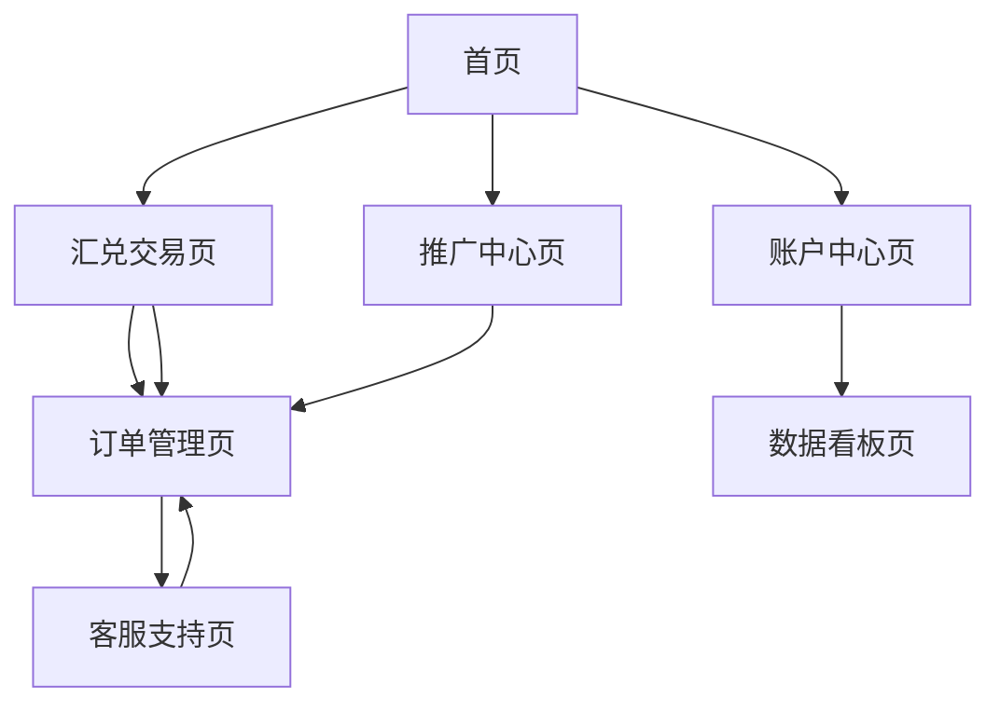

# 数字货币汇兑平台产品需求文档

面向全球中小商家的数字货币稳定币与主流法币快速汇兑平台，通过技术驱动实现30分钟内完成汇兑服务。

## 1. 产品概述

本平台是一个面向全球中小商家的数字货币汇兑服务平台，支持稳定币（USDT、USDC等）与主流法币（美元、港币、离岸人民币）的快速双向兑换。用户可以充入数字货币，在30分钟内收到银行转账的法币，解决中小商家跨境支付和资金流转的痛点。

平台采用PLG（Product-Led Growth）策略，通过优秀的产品体验、自助服务和病毒式传播机制驱动用户增长，降低获客成本并提高用户留存率。

## 2. 核心功能

### 2.1 用户角色

| 角色 | 注册方式 | 核心权限 |
|------|----------|----------|
| 普通商家 | 邮箱+手机号注册 | 基础汇兑服务，单日限额5万美元 |
| 认证商家 | KYC认证升级 | 高级汇兑服务，单日限额50万美元，优先处理 |
| 代理商 | 邀请码注册 | 推广返佣，客户管理，专属汇率 |

### 2.2 功能模块

我们的数字货币汇兑平台包含以下核心页面：
1. **首页**：产品介绍、实时汇率展示、快速注册入口
2. **汇兑交易页**：币种选择、金额输入、汇率计算、订单提交
3. **订单管理页**：交易历史、订单状态跟踪、收据下载
4. **账户中心页**：资产概览、银行卡管理、安全设置
5. **推广中心页**：邀请链接生成、返佣统计、下级用户管理
6. **客服支持页**：在线客服、常见问题、申诉处理
7. **数据看板页**：交易统计、市场分析、风险监控

### 2.3 页面详情

| 页面名称 | 模块名称 | 功能描述 |
|----------|----------|----------|
| 首页 | 产品介绍区 | 展示平台优势、服务流程、安全保障，吸引用户注册 |
| 首页 | 实时汇率展示 | 显示主要币种实时汇率、24小时涨跌幅、市场趋势图表 |
| 首页 | 快速注册入口 | 一键注册按钮、社交登录选项、新用户优惠展示 |
| 汇兑交易页 | 币种选择器 | 支持USDT/USDC转USD/HKD/CNH，智能推荐最优汇率 |
| 汇兑交易页 | 金额计算器 | 实时汇率计算、手续费透明展示、到账金额预览 |
| 汇兑交易页 | 订单确认 | 收款信息确认、风险提示、订单提交和支付 |
| 订单管理页 | 交易历史 | 订单列表、状态筛选、详情查看、收据导出 |
| 订单管理页 | 实时跟踪 | 订单进度条、预计到账时间、异常处理提醒 |
| 账户中心页 | 资产管理 | 数字货币余额、法币账户、资产变动记录 |
| 账户中心页 | 银行卡管理 | 添加/删除银行卡、收款账户验证、快捷支付设置 |
| 账户中心页 | 安全中心 | 双重认证、登录记录、设备管理、密码修改 |
| 推广中心页 | 邀请系统 | 生成专属邀请码、分享链接、邀请奖励规则 |
| 推广中心页 | 返佣统计 | 推广收益、下级用户数据、提现申请 |
| 客服支持页 | 智能客服 | AI机器人问答、常见问题库、人工客服转接 |
| 客服支持页 | 申诉处理 | 交易争议提交、证据上传、处理进度跟踪 |
| 数据看板页 | 交易统计 | 个人交易数据、市场占有率、收益分析 |
| 数据看板页 | 风险监控 | 账户安全评分、异常交易提醒、合规状态 |

## 3. 核心流程

**普通用户汇兑流程：**
用户注册登录 → 选择汇兑币种和金额 → 确认汇率和手续费 → 提交订单并充值数字货币 → 系统自动处理 → 30分钟内收到银行转账 → 交易完成

**推广用户流程：**
注册成为代理商 → 获取专属邀请码 → 分享给目标客户 → 客户完成交易 → 获得返佣收益 → 提现到账

**风控处理流程：**
订单提交 → 自动风控检测 → 异常订单人工审核 → 通过后继续处理 → 拒绝则退回资金

## 4. 用户界面设计

### 4.1 设计风格

- **主色调**：深蓝色(#1B365D)代表信任和专业，辅助色为金色(#FFD700)突出价值
- **按钮样式**：圆角矩形按钮，渐变色设计，hover效果明显
- **字体**：中文使用思源黑体，英文使用Roboto，主要字号16px，标题24px
- **布局风格**：卡片式设计，顶部导航栏，响应式网格布局
- **图标风格**：线性图标配合实心图标，统一使用Feather Icons图标库

### 4.2 页面设计概览

| 页面名称 | 模块名称 | UI元素 |
|----------|----------|--------|
| 首页 | 产品介绍区 | 大背景图、渐变遮罩、白色大标题、CTA按钮使用金色渐变 |
| 首页 | 实时汇率展示 | 卡片式布局、绿红色涨跌标识、Chart.js图表组件 |
| 汇兑交易页 | 币种选择器 | 下拉选择框、币种图标、实时汇率数字跳动动画 |
| 汇兑交易页 | 金额计算器 | 大号输入框、计算结果实时更新、费用明细表格 |
| 订单管理页 | 交易历史 | 表格布局、状态标签、分页组件、搜索筛选栏 |
| 账户中心页 | 资产管理 | 仪表盘样式、饼图显示资产分布、数字动画效果 |
| 推广中心页 | 邀请系统 | 二维码生成、社交分享按钮、复制链接功能 |
| 客服支持页 | 智能客服 | 聊天气泡界面、打字动画、快捷回复按钮 |

### 4.3 响应式设计

平台采用移动优先的响应式设计，支持桌面端、平板和手机端访问。移动端优化触摸交互，增大按钮点击区域，简化操作流程，确保在小屏幕上的良好用户体验。