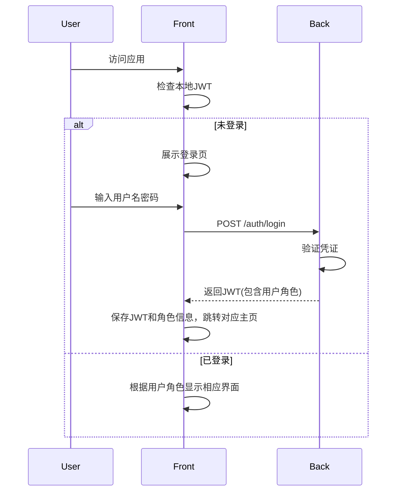
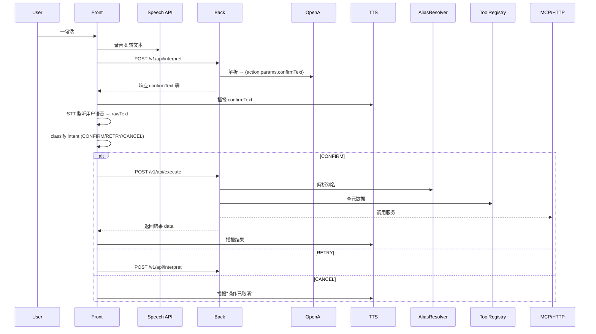

# 全语音AI-Agent平台的产品需求文档（PRD）
**状态：** 已批准·正在实施

---

## 1. 引言

**1.1 项目描述**  
"全语音AI-Agent平台"是一个端到端、以语音为唯一交互手段的智能代理系统。用户一句话即可调度海量"技能"（MCP 脚本、第三方 HTTP API 等），并通过实时的 TTS 语音反馈，获得即时、精准的服务体验。

**1.2 项目范围概览**  
- **MVP 范围**：单次调用单个功能的端到端闭环体验
- **后续迭代**：多工具编排、多轮确认、动态加载技能、并行/串联调用、日志监控、CI/CD、K8s 部署

**1.3 业务背景与驱动**  
- **市场需求**：自然语言交互普及，用户期望低门槛的智能服务
- **技术机遇**：大模型（LLM）与浏览器 STT/TTS 技术成熟
- **竞争优势**：零点击、语音即服务，适配车载、IoT、可穿戴场景

**1.4 目标用户／利益相关者**  
- **终端用户**：普通消费者，需"一句话"完成查询、控制等操作
- **第三方开发者**：提供 HTTP API 或 MCP 脚本，快速接入平台
- **内部团队**：前端、后端、测试、运维、产品经理

---

## 2. 目标与 KPI

**2.1 项目目标**  
1. 实现"一句话→解析→复述确认→执行→播报"的完整闭环  
2. 极简接口规范，第三方技能 30 分钟内接入

**2.2 可衡量成果**  
- **端到端调用成功率**：≥90%  
- **意图解析准确率（MVP）**：≥80%  
- **平均解析+执行时长**：≤500ms  

**2.3 成功标准**  
- 二次修改失败率 ≤5%  
- 前后端联调问题 ≤5 个/Sprint  
- 第三方接入时间 ≤30 分钟

**2.4 关键绩效指标（KPIs）**  
| KPI               | 目标值    |
|------------------|-----------|
| 端到端成功率     | ≥90%      |
| 平均解析时长     | ≤200ms    |
| 平均执行时长     | ≤300ms    |
| 二次修改失败率   | ≤5%       |
| 第三方接入时间   | ≤30min    |

### 2.5 MVP阶段开发原则

1.  **聚焦核心价值**：在MVP（最小可行产品）阶段，所有开发活动应优先服务于核心业务流程的实现、验证和迭代，快速向市场推出能够解决用户核心痛点的产品。
2.  **敏捷与迭代**：快速迭代，小步快跑。优先完成核心功能的端到端闭环。
3.  **需求驱动开发**：AI助手及开发团队应严格按照明确的用户需求和产品规划进行开发，避免在MVP阶段引入非核心、未经充分验证或可能导致项目复杂化、延期的功能。
4.  **资源审慎投入**：对于需要大量投入但对当前阶段核心用户体验提升或用户增长不构成直接显著影响的特性（例如，超出Web内容无障碍指南（WCAG）AA级别合规性的深度、专项无障碍优化），应在MVP阶段审慎评估其优先级和投入产出比，可考虑在产品成熟、用户基数扩大后再行投入。基础的无障碍实践（如语义化HTML、键盘可访问性、足够的颜色对比度）应作为质量保障的一部分，但不应过度扩展。

---

## 3. 功能需求

### 3.1 前端需求  
- **技术框架**：React 18 + Vite + Ant Design Mobile + Web Speech API  
- **核心模块**：
  - **认证系统**：登录/注册界面，JWT认证，AuthContext，基于角色的权限控制(user/developer/admin)
  - **录音 & STT**：实时语音转文本
  - **进度状态**：识别/理解/执行/完成四阶段进度展示
  - **AI 复述 & 确认**：TTS + 自动 STT 分类 CONFIRM/RETRY/CANCEL
  - **结果反馈**：动态卡片展示执行结果
  - **技能列表**：列表/卡片/网格视图切换，搜索过滤
  - **用户配置**：contacts、wallets等用户数据管理
  - **全局弹窗**：Toast系统，错误、超时、重试提示
  - **错误边界**：React ErrorBoundary 捕获渲染错误
  - **第三方开发者Portal**：上传、管理自定义API，仅对具有developer或admin角色的用户可见
- **设计系统**：
  - **设计令牌**：CSS变量驱动所有样式
    - 色彩：主色 #4FD1C5，背景 #1E1E2F，文本 #F8F8F8，错误 #F56565，警告 #ECC94B
    - 间距：8px(sm)/16px(md)/24px(lg)
    - 圆角：8px
    - 字体：Inter, sans-serif
  - **响应式策略**：Mobile-First + 断点适配
  - **主题切换**：支持运行时动态调整（包括深色/浅色模式及自定义主题参数），持久化到localStorage
  - **组件一致性**：所有UI组件统一使用设计令牌

### 3.2 后端需求  
- **技术栈**：Python + FastAPI + Uvicorn  
- **NLU 引擎**：OpenAI Python SDK（GPT-3.5/4）  
- **核心接口**（JWT 鉴权，前缀 `/v1`）：
  - `POST /auth/register`：
    - **请求**：
      ```json
      {"username":"<string>","email":"<string>","password":"<string>"}
      ```  
    - **响应 201**：
      ```json
      {"id":<int>,"username":"<string>","email":"<string>"}
      ```  
  - `POST /auth/login`：
    - **请求**：
      ```json
      {"username":"<string>","password":"<string>"}
      ```  
    - **响应 200**：
      ```json
      {"token":"<JWT>","user":{"id":<int>,"username":"<string>"}}
      ```
  - `POST /v1/api/interpret`：
    - **请求**：
      ```json
      {"sessionId":"<UUID>","userId":<int>,"text":"用户转写文本"}
      ```  
    - **响应 200**：
      ```json
      {"type":"confirm","action":"toolId","params":{...},"confirmText":"复述文本"}
      ```  
    - **错误**：4xx/5xx + `{error:{code,msg}}`
  - `POST /v1/api/execute`：
    - **请求**：
      ```json
      {"sessionId":"<UUID>","userId":<int>,"action":"toolId","params":{...}}
      ```  
    - **响应 200**：
      ```json
      {"success":true,"data":{...}}
      ```  
    - **错误**：
      ```json
      {"success":false,"error":{"code":"EXEC_FAIL","message":"..."}}
      ```
  - `GET /v1/api/tools`：
    - **响应 200**：
      ```json
      {"tools":[{"tool_id":"<string>","name":"<string>","description":"<string>","type":"<string>"}]}
      ```
- **错误码**：INVALID_PARAM、UNKNOWN_ALIAS、EXEC_FAIL、SERVICE_UNAVAILABLE、TIMEOUT、AUTH_FAILED

### 3.3 数据库设计  
- **持久化方案**：MySQL + SQLAlchemy + Alembic
- **核心表 DDL**：
  ```sql
  CREATE TABLE users (
    id BIGINT PRIMARY KEY AUTO_INCREMENT,
    username VARCHAR(64) UNIQUE NOT NULL,
    email VARCHAR(128) UNIQUE NOT NULL,
    password_hash VARCHAR(256) NOT NULL,
    role ENUM('user', 'developer', 'admin') NOT NULL DEFAULT 'user', -- 用户角色: 普通用户、开发者、管理员
    contacts JSON,
    wallets JSON,
    created_at DATETIME DEFAULT CURRENT_TIMESTAMP
  );
  CREATE TABLE tools (
    tool_id VARCHAR(64) PRIMARY KEY,
    name VARCHAR(128) NOT NULL,
    type ENUM('mcp','http') NOT NULL,
    endpoint JSON NOT NULL,
    request_schema JSON NOT NULL,
    response_schema JSON NOT NULL,
    created_at DATETIME DEFAULT CURRENT_TIMESTAMP
  );
  CREATE TABLE sessions (
    session_id CHAR(36) PRIMARY KEY,
    user_id BIGINT NOT NULL,
    status ENUM('interpreting','waiting_confirm','executing','done','error') NOT NULL,
    created_at DATETIME DEFAULT CURRENT_TIMESTAMP,
    updated_at DATETIME DEFAULT CURRENT_TIMESTAMP ON UPDATE CURRENT_TIMESTAMP,
    FOREIGN KEY(user_id) REFERENCES users(id)
  );
  CREATE TABLE logs (
    id BIGINT PRIMARY KEY AUTO_INCREMENT,
    session_id CHAR(36) NOT NULL,
    step VARCHAR(32) NOT NULL,
    status VARCHAR(32) NOT NULL,
    message TEXT,
    timestamp DATETIME DEFAULT CURRENT_TIMESTAMP,
    FOREIGN KEY(session_id) REFERENCES sessions(session_id)
  );
  ```

---

## 4. 技术框架
| 层级      | 技术选型                                              |
|-----------|------------------------------------------------------|
| 前端      | React 18 + Vite + Ant Design Mobile + Web Speech API |
| 后端      | Python + FastAPI + Uvicorn                           |
| NLU       | OpenAI SDK (Python)                                  |
| STT/TTS   | 浏览器 Web Speech API                                |
| 数据库    | MySQL + SQLAlchemy + Alembic                         |
| 会话管理  | JWT + Redis (可选)                                   |
| 测试工具  | Jest + RTL + Cypress + MSW                           |
| 自动化    | Cursor CLI + auto-dev.sh                             |
| 部署运维  | Docker Compose → Kubernetes（后续）                  |

---

## 5. 交互流程

### 5.1 认证流程


### 5.2 核心交互流程


---

## 6. 已实现功能与近期更新

### 6.1 已实现功能
- **后端核心功能**：
  - API架构：FastAPI基础架构、路由、控制器、服务层
  - 数据库模型：用户、工具、会话、日志
  - 意图解析：基于LLM的意图理解
  - 工具执行：MCP和HTTP工具调用
  - 用户认证：JWT授权机制

- **前端核心组件**：
  - 语音交互：VoiceRecorder组件（录音/STT）
  - 状态管理：SessionContext、进度条显示
  - 结果展示：ResultDisplay组件
  - API集成：apiClient服务封装
  - 设计系统：统一设计令牌系统，实现主题切换（ThemeContext, ThemeToggle, ThemeSettings, StyleEditor）和样式调试
  - 全局布局：包括 Header 和 Footer 组件
  - 错误处理：ErrorBoundary组件
  - **第三方开发者Portal**：上传、管理自定义API，仅对具有developer或admin角色的用户可见。核心UI (`DeveloperConsolePage`) 已实现并通过单元测试，覆盖服务列表展示、状态切换和删除功能。

### 6.2 近期更新 (2025-05-15)
- **后端**：
  - 完成了HTTP工具调用支持（Dify平台、Coze平台、通用HTTP API）
  - 实现了用户身份认证系统（注册/登录API、JWT中间件）
  - 修复了session_id在API响应中为null的问题
  - 开始优化技能服务目录，支持列表/网格视图切换和搜索
  - 优化了响应式策略，采用Mobile-First方法，实现断点适配

- **2025-05-19 (或当前日期)**:
  - **前端**：完成了主题系统（包括深色/浅色模式切换 `ThemeToggle`、自定义主题设置 `ThemeSettings`、样式调试面板 `StyleEditor`）的开发和单元测试。核心组件（`ThemeToggle`, `ThemeSettings`, `SettingsPage`）已通过 `jest-axe` 无障碍规范检查。
  - **前端**：实现了页脚（`Footer`）组件，并将其集成到主应用布局（`AppLayout`）中，完成了单元测试和 `jest-axe` 无障碍检查。
  - **前端**：更新了 `TASKS.md` 中相关任务 (T004, T004-1, T004-1-3, T004-3-1, T004-3-3, T007-5) 的状态为"已完成"。
  - **文档**：更新了前端开发文档和产品需求文档以反映最新的开发进展。

---

## 7. 接下来优先实施计划

1. **前端认证系统**：
   - 完成登录和注册组件
   - 实现AuthContext全局状态
   - 添加路由保护机制
   - 实现JWT存储和刷新

2. **通用提示系统**：
   - 实现Toast/Modal组件系统
   - 统一错误处理流程
   - 集成设计令牌确保风格一致

3. **技能服务目录**：
   - 完善列表/网格视图切换
   - 实现搜索过滤功能
   - 优化服务卡片设计
   - 支持第三方开发者上传的服务

4. **自动化测试环境**：
   - 完善Cypress E2E测试
   - 集成MSW模拟后端API
   - 优化auto-dev.sh自动化流程

5. **主题与样式**：
   - 实现运行时主题切换
   - 创建样式调试面板
   - 完善响应式适配策略

---
