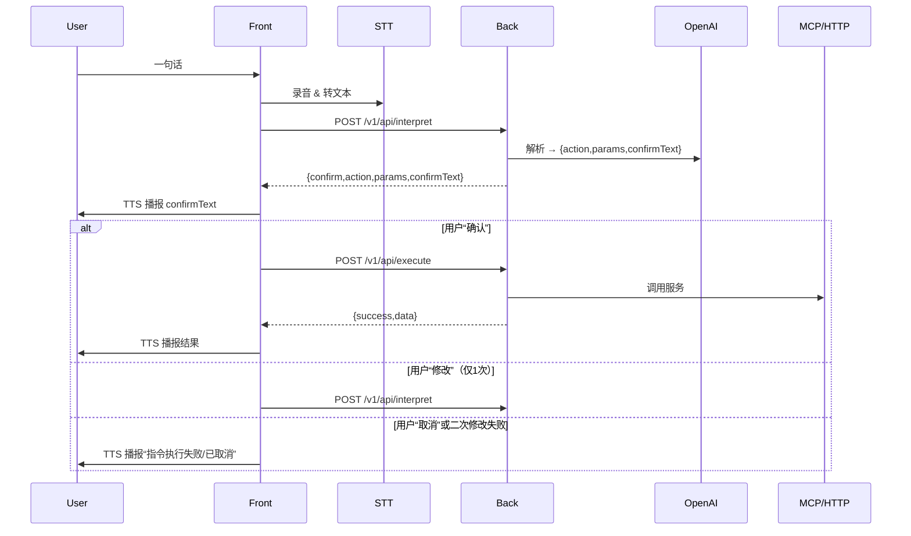

**{项目名称}的产品需求文档（PRD）**
**状态：** 草稿·已批准

---

## 1. 引言

**1.1 项目描述**  
“全语音AI-Agent平台”是一个端到端的、以语音为唯一交互手段的智能代理系统。用户一句话即可调度海量“技能”（MCP 脚本、第三方 HTTP API 等），并通过实时的 TTS 语音反馈，获得即时、精准的服务体验。

**1.2 项目范围概览**  
- **MVP 范围**：单次调用单个功能的闭环体验
- **后续迭代**：多工具编排、多轮确认、动态加载技能、日志监控、并行/串联调用

**1.3 业务背景和驱动因素**  
- **市场需求**：语音交互日益普及，用户追求自然、低门槛的智能服务
- **技术机遇**：大模型（LLM）与浏览器 STT/TTS 技术成熟，可快速上线
- **竞争优势**：零点击、零输入，语音即服务，适配车载、IoT、可穿戴等场景

**1.4 目标用户／利益相关者**  
- **终端用户**：C 端消费者，需快速调用日常技能
- **第三方开发者**：提供各类 HTTP API 或 MCP 脚本
- **内部团队**：前端、后端、测试、运维、产品经理

---

## 2. 目标与 KPI

**2.1 项目目标**  
1. 在主流浏览器实现“一句话→解析→执行→播报”完整闭环
2. 提供极简 API，第三方技能可 30 分钟内接入

**2.2 可衡量成果**  
- **端到端调用成功率**：≥90%
- **意图解析准确率（MVP）**：≥80%
- **平均响应时长**（解析+执行，不含播报）：≤500ms

**2.3 成功标准**  
- 用户修改二次失败率 ≤5%
- 前后端联调问题 ≤5 个/Sprint
- 第三方接入时间 ≤30 分钟

**2.4 关键绩效指标（KPIs）**
| KPI                      | 目标值    |
|--------------------------|-----------|
| 端到端调用成功率         | ≥90%      |
| 平均解析时长             | ≤200ms    |
| 平均执行调用时长         | ≤300ms    |
| 用户修改失败率           | ≤5%       |
| 第三方技能接入时间       | ≤30min    |

---

## 3. 功能需求

### 3.1 前端需求
- **技术框架**：React + Ant Design 或 Material-UI  
- **核心模块**：  
  1. 录音 & STT（Web Speech API，超时 10s）  
  2. 四步进度状态（识别中 / 理解中≤5s / 执行中≤15s / 已完成）  
  3. AI 复述 & 确认（TTS 播报 `confirmText`，监听“确认/修改/取消”，仅一次修改机会）  
  4. 结果反馈（TTS + 文本展示）  
  5. 功能列表面板（技能搜索与展示）  
  6. 用户配置管理（表单收集并校验 `contacts`、`wallets`）

### 3.2 后端需求
- **后端技术栈**：Node.js + Express  
- **NLU 引擎**（MVP）：符合 OpenAI SDK 标准的大模型（如 GPT-3.5/GPT-4）  
- **核心接口**（均带 `/v1` 前缀、JWT 鉴权）  
  - `POST /v1/api/interpret`  
  - `POST /v1/api/execute`  
- **请求/响应 Schema**：  
  ```yaml
  components:
    schemas:
      InterpretRequest: { sessionId:string, userId:int, text:string }
      InterpretResponse: { type:"confirm", action:string, params:object, confirmText:string }
      ExecuteRequest: { sessionId:string, userId:int, action:string, params:object }
      ExecuteResponse: { success:bool, data?:object, error?:{code:string,msg:string} }
  ```
- **错误码**：INVALID_PARAM、UNKNOWN_ALIAS、EXEC_FAIL、SERVICE_UNAVAILABLE、TIMEOUT

### 3.3 数据库设计
- **持久化：MySQL**（关系型数据库）  
- **核心表结构**：  
  1. `users(id, username, contacts JSON, wallets JSON, created_at)`  
  2. `tools(tool_id, name, type ENUM('mcp','http'), endpoint JSON, request_schema JSON, response_schema JSON, created_at)`  
  3. `sessions(session_id, user_id FK, status ENUM, created_at, updated_at)`  
  4. `logs(id, session_id FK, step, status, message, timestamp)`

---

## 4. 技术框架
| 层级      | 技术选型                                    |
|-----------|--------------------------------------------|
| 前端      | React + Ant Design/Material-UI, Web Speech API |
| 后端      | Node.js + Express                          |
| NLU       | OpenAI SDK（GPT-3.5/4）                     |
| STT/TTS   | 浏览器 Web Speech API                      |
| 持久化    | MySQL（关系型数据库）                      |
| 会话管理  | JWT + Redis（可选）                         |
| 部署/运维 | Docker Compose → Kubernetes（后续）         |

---

## 5. 交互流程


---

## 6. 已实现功能备注
1. **MCP 客户端接入**：`connect(mcp_script_path)` → 一次性传入脚本路径，无需用户中途选择
2. **工具调用**：`call_tool(tool_name, **params)` 已提供示例代码和注释
3. **会话管理**：通过 `sessionId` 保持上下文，并支持优雅关闭

---

> **后续迭代（非 MVP）**：多工具编排、并发/串联调用、深入监控、CI/CD 和 K8s 部署等

