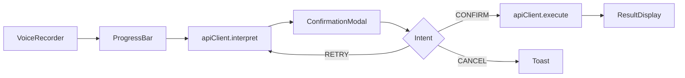

# 全语音AI-Agent平台前端开发文档（Canvas）

## 一、概览 (Overview)
- **技术栈**：React + Ant Design / Material-UI + Web Speech API + Axios + React Context + Framer Motion
- **主题风格**：极简科技感，暗色/深色主题，主色 #4FD1C5，背景 #1E1E2F，文本 #F8F8F8
- **响应式策略**：桌面优先，后续支持移动端小屏
- **目录结构示意**：
  ```text
  src/
  ├── components/       # UI 组件
  ├── hooks/            # 自定义 Hooks (useVoice, useApi, useIntent)
  ├── services/         # API 调用（axios 实例 & apiClient 封装）
  ├── contexts/         # 全局状态 (Session, UserConfig, Theme)
  ├── mocks/            # Mock 数据 (仅 dev)
  ├── utils/            # 工具函数 (格式化、schema 校验)
  ├── styles/           # 主题与全局样式
  ├── pages/            # 开发者 & 管理员界面（后续迭代）
  ├── App.jsx           # 根组件
  └── index.js
  ```

---

## 二、UI/UX 指南
1. **配色 & 字体**：Inter / Roboto；主色 #4FD1C5；背景 #1E1E2F；文本 #F8F8F8
2. **动效**：页面过渡、状态切换使用 Framer Motion；按钮动效微波纹
3. **布局**：侧边栏 + 主区；底部固定状态栏，显示录音/识别/执行进度
4. **技能列表展示**：支持侧边栏列表、卡片/网格视图切换，提高可视化与可读性（后续可用 AntD Card/Grid 实现）

---

## 三、核心功能模块 & 组件列表
| 功能         | 组件             | 描述                                          | 输入 / 输出                       |
|--------------|------------------|----------------------------------------------|----------------------------------|
| 录音 & STT    | VoiceRecorder    | 点击或唤醒词触发 STT，10s 超时提示             | onResult(text), onError()        |
| 进度状态栏    | ProgressBar      | 四阶段：识别中→理解中→执行中→完成              | props.stage                      |
| 复述 & 确认    | ConfirmationModal| TTS 播报 confirmText，STT 监听确认意图          | onIntent(intent)                 |
| 结果反馈      | ResultDisplay    | TTS + 文本展示执行结果                         | props.data                       |
| 技能列表      | SkillSidebar     | 列出/搜索所有技能，支持列表与卡片/网格两种视图    | onSelect(skill)                  |
| 用户配置      | UserSettings     | 表单管理 contacts & wallets，JSON 校验        | onSave(config)                   |
| 通知 & 弹窗    | Toast/Modal      | 错误、超时、重试提示                           | show(message, type)              |
| API 客户端    | apiClient        | 语义化封装接口：interpret、execute、getServices | 调用 services/api.js             |
| STT/TTS 库    | useVoice、useIntent | 支持原生或第三方库（react-speech-recognition）  | Hooks 封装 STT/TTS 与意图分类    |

---

## 四、组件依赖 & 调用关系


---

## 五、状态管理 (State & Data Flow)
- 使用 React Context 管理：
  - **SessionContext**：sessionId, stage
  - **UserConfigContext**：contacts, wallets
  - **ThemeContext**：亮/暗色模式
- Hooks：
  - `useSession()` 管理对话流程
  - `useVoice()` 封装 Web Speech API
  - `useIntent()` 统一意图分类（规则 + 模糊 + LLM）

---

## 六、API 对接
1. **环境变量**：
   ```env
   REACT_APP_API_BASE_URL=https://api.example.com/v1
   ```
2. **apiClient 封装** (`src/services/apiClient.js`)
   ```js
   import axios from 'axios';
   const api = axios.create({ baseURL: process.env.REACT_APP_API_BASE_URL, timeout:10000 });
   api.interceptors.request.use(req=>{ req.headers.Authorization = `Bearer ${token}`; return req; });
   export default {
     interpret: (text, sessionId) => api.post('/interpret', { text, sessionId }),
     execute: (action, params, sessionId) => api.post('/execute', { action, params, sessionId }),
     getServices: () => api.get('/tools')
   };
   ```
3. **错误 & 超时**：
   - interpret 超时 5s → 重试 or Toast
   - execute 超时 15s → 提示重试按钮

---

## 七、录音/STT & TTS 确认流程
```mermaid
timer
sequenceDiagram
  User->>VoiceRecorder: 触发录音
  VoiceRecorder->>SpeechAPI: 录音 & 转文本
  SpeechAPI-->>Interpret: 返回 text
  Interpret->>TTS: 播报 confirmText
  TTS-->>VoiceRecorder: 播报结束触发 STT
  VoiceRecorder->>IntentClassifier: 用户语音 -> intent
  IntentClassifier-->>execute/interpret/cancel
```  

---

## 八、Mock 数据 & 环境区分
- **环境变量**：
  - `NODE_ENV=development` 加载 `src/mocks/index.js`
- **Mock 目录**：`setupMocks(api)` 注册接口模拟
- **契约测试**：JSON Schema 校验 Mock 与真实接口一致

---

## 九、开发者 & 管理员界面规划（后续迭代）
- **开发者页面**：
  - 提交接入文档、Key、URL
  - 查看接入状态与日志
- **管理员页面**：
  - 用户管理、服务审核、日志监控
  - 采用 Ant Design Pro 模板实现

---

## 十、测试与调试
- **单元测试**：Jest + React Testing Library
- **Mock Server**：自动加载 mocks，支持离线开发
- **启动脚本**：`npm run start:dev` 启动 Mock + 本地前端

---

## 十一、分工建议
- **录音 & STT**：A 同学  
- **Interpret Flow & ProgressBar**：B 同学  
- **Confirmation & Intent**：C 同学  
- **ResultDisplay & SkillSidebar**：D 同学  
- **UserSettings & 状态管理**：E 同学  

> 本文档可直接用于任务拆分和并行开发，覆盖 UI、交互、状态、API、Mock、迭代规划等全流程。

## 十二、实现进度与状态记录 (2025年4月30日更新)

### 已实现并测试的功能

1. **基础UI组件搭建**：
   - `MainPage` 组件：作为主界面容器
   - `VoiceRecorder` 组件：实现语音输入按钮及相关逻辑
   - `StatusBar` 组件：展示当前应用状态（空闲、监听中、思考中、执行中等）

2. **语音识别 (STT) 集成**：
   - 使用 Web Speech API 成功将用户语音转换为文本
   - 识别结果能够传递给父组件并显示在界面上
   - 已处理语音识别的各种状态和错误

3. **后端API集成**：
   - 创建 `apiClient.js` 服务封装API调用
   - 成功实现 `/interpret` API的调用
   - 能够发送用户语音文本，接收并处理后端返回的确认文本
   - 实现了 `/execute` API的调用代码
   - 添加了对执行结果的处理逻辑
   - 包含错误处理机制

4. **状态管理**：
   - 使用 React 状态钩子管理应用状态
   - 实现了 `sessionId` 生成与管理
   - 状态转换链：idle -> listening -> thinking -> speaking -> listening(确认) -> executing -> speaking(结果) -> idle

5. **用户确认交互流程**：
   - 实现了AI复述确认后，监听用户回应的逻辑
   - 成功识别确认/取消等关键词
   - 基于用户确认，触发不同的后续流程

### 当前存在的问题

1. **TTS功能缺失**：
   - `useTTS` hook在最近的代码迭代中丢失
   - 前端编译报错：`Can't resolve '../../hooks/useTTS'`
   - 需要重新实现或恢复此功能

2. **代码质量问题**：
   - ESLint警告：包括未使用变量和不必要的转义字符
   - 需要代码清理和优化

3. **后端连接问题**：
   - 后端API请求参数不匹配问题（`process_intent` 参数数量错误）
   - 前后端接口需要进一步对接

### 待实现的功能

1. **交互流程完整性测试**：
   - 端到端测试：从语音输入到最终结果播报
   - 各种错误场景和边缘情况处理

2. **技能列表展示**：
   - 技能列表侧边栏或卡片/网格视图
   - 技能选择和搜索功能

3. **用户配置功能**：
   - 用户设置界面
   - contacts和wallets等用户数据的管理

4. **UI完善**：
   - 响应式设计优化
   - 深色/浅色主题切换
   - 动画效果增强
   - 无障碍优化

5. **扩展功能**：
   - 开发者页面
   - 管理员界面
   - 多端适配

### 下一步优先任务

1. 恢复 `useTTS` 功能，解决TTS播报问题
2. 修复前后端接口对接参数不匹配问题
3. 完成完整交互流程的端到端测试
4. 优化用户界面和用户体验

